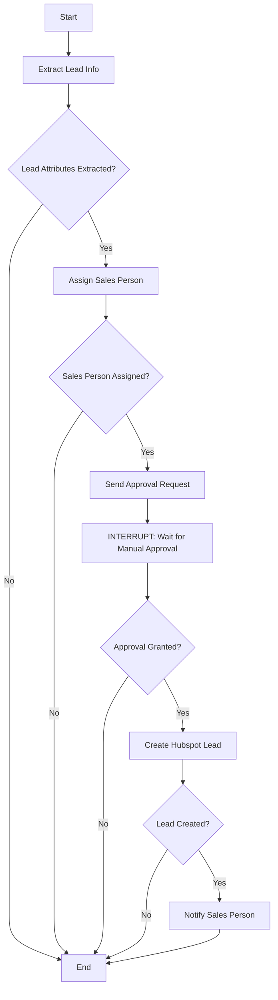

# Slack Lead Processing Workflow

This module implements a LangGraph workflow that processes leads from Slack messages, assigns them to appropriate sales people, and creates them in Hubspot after approval.

## Workflow Overview

The workflow consists of the following steps:

1. **Extract Lead Information**: Extracts key attributes (geo_location, industry, engagement) from the Slack message.
2. **Assign Sales Person**: Assigns a sales person based on predefined criteria:
   - If geo_location is New York, industry is Insurance, and engagement is services, assign to Edward
   - If geo_location is CA, industry is Automobile, and engagement is services, assign to John
   - For all other combinations, assign to the general Sales Team
3. **Send Approval Request**: Sends an approval request to the admin with the lead details and assigned sales person.
   - **Workflow Interruption**: The workflow pauses here and waits for manual approval
4. **Create Hubspot Lead**: If approved, creates the lead in Hubspot with all necessary fields.
5. **Notify Sales Person**: Notifies the assigned sales person about the new lead.

## Components

- **graph.py**: Defines the workflow graph with all nodes and routing logic
- **state.py**: Defines the state structure for the workflow
- **tools.py**: Implements the tools used in the workflow
- **utils.py**: Provides utility functions for the workflow
- **prompts.py**: Contains the system prompt for the agent
- **configuration.py**: Defines the configurable parameters for the workflow
- **demo.py**: Provides a demo script to test the workflow

## Usage

To run the demo:

```bash
python -m slack_approval.demo
```

The demo will:
1. Start the workflow with a sample Slack event
2. Process the lead up to the approval step
3. Pause and wait for manual approval input
4. Continue the workflow if approved, or terminate if denied

## Input Format

The workflow expects a Slack event in the following format:

```json
{
  "event": "lead_posted",
  "user": {
    "id": 123,
    "name": "John Doe",
    "email": "john.doe@example.com"
  },
  "slack_message": {
    "id": 123,
    "channel": "eco_cart_leads",
    "content": "New lead from New York in the Insurance industry looking for services."
  },
  "timestamp": "2025-02-26T12:00:00Z"
}
```

## Workflow Diagram


